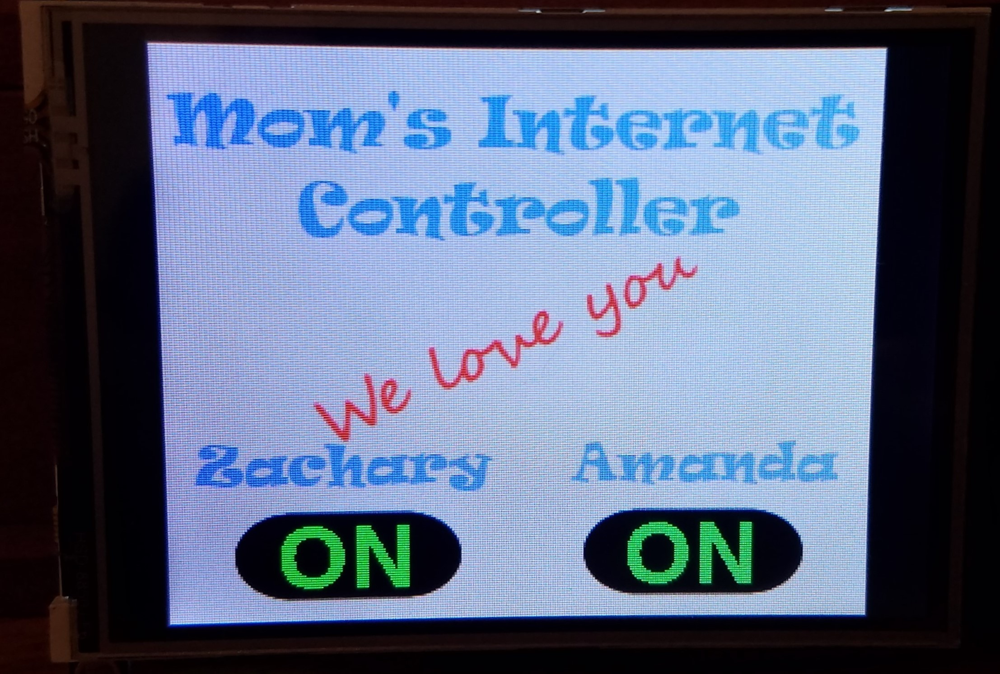

# Mom's Internet Controller

Mom asked for a way to shut off our kid's access to the internet.  So here we are.

First a little background.  Our wifi access point is made by a company called Meraki.  The group at Meraki has an excellent REST API interface to their platform.  One of the APIs that they've exposed is the ability to assign an access policy on a per client basis.  In this case I have two seperate access policies, Blocked and Normal.  

Here is normal operation, both kids have internet access:

PyPortal:

Meraki Dashboard:

Here is Amanda's devices being blocked / off:

PyPortal:

Meraki Dashboard:

Console output log of the entire process:

A/B.  At boot up, current state is pulled for both kids

C.  REST reponse from Meraki after Amanda's devices being turned off.

D.  REST reponse from Meraki after Amanda's devices being turned on.

- Note:

In the lib folder you'll find adafruit_pyportal.mpy, this library was written by Adafruit.  The different being that I added two methods (mput and mfetch) as I needed their code to behave a bit differently.  You can view the source (non compiled version) in the file adafruit_pyportal.py in the same directory.
